# Logging on to the Most Awesome Conferencing Service

Welcome to my video conferencing server, _zhum_. This is not to be confused with [Zoom](https://www.zoom.com), an inferior and big brotherish service that spies on you and sells your data.

This server runs [Jitsi](https://jitsi.org/), an open-source WebRTC server that is encrypted and self-hosted by moi right here in Austin, TX.

The connection guide below will set you up with the `vanstolk` meeting room but you are welcome to create your own room to meet with friends as well if you'd like.

#### How to Connect

- [Desktop Browser](#browser)
- [Android](#android)
- [iOS](#ios)

# Browser

- Go to https://zhum.xyz. _Make sure there is a `s` after `http`, and there is no `www` preceeding the url_.

- At the 'Start a new meeting' prompt, type `vanstolk`. Hit `Go`.

- Allow access to the camera and microphone.

# Android

- Download [jitsi meet](https://play.google.com/store/apps/details?id=org.jitsi.meet&hl=en_US) from the google play store.

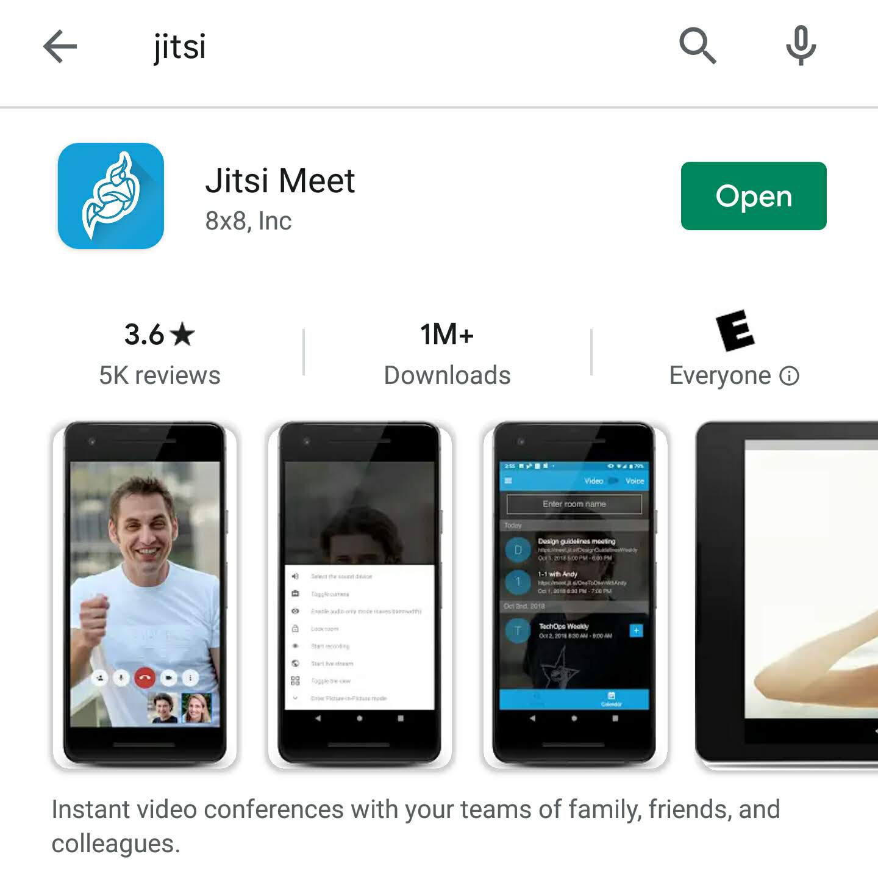

- Open the app and click on the menu icon (three horizontal bars) in the upper left. Click 'settings'.

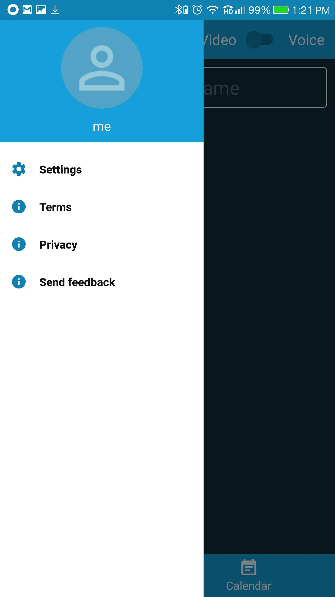

- Change the server URL to `https://zhum.xyz`. You can fill in your name if you'd like. You don't need to fill in your email.

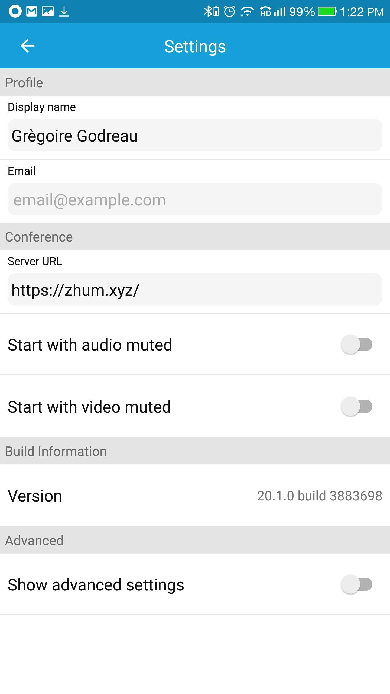

- Go back to the main jitsi app screen. Click on the `Enter room name` box.

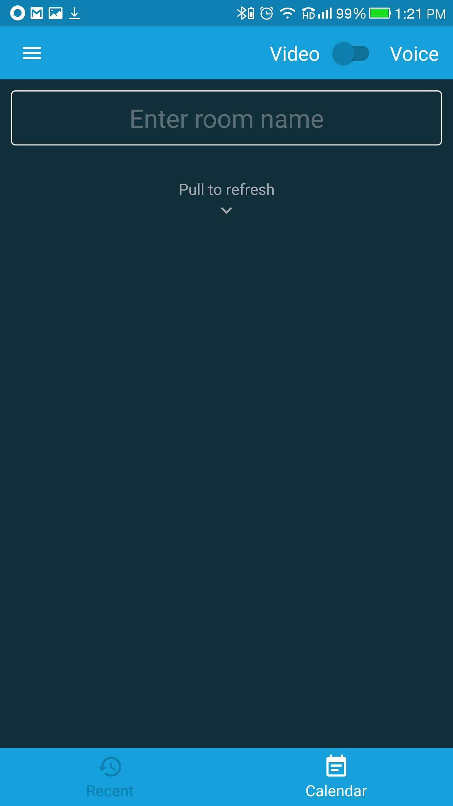

- Type `vanstolk`. Hit `Create/Join`.

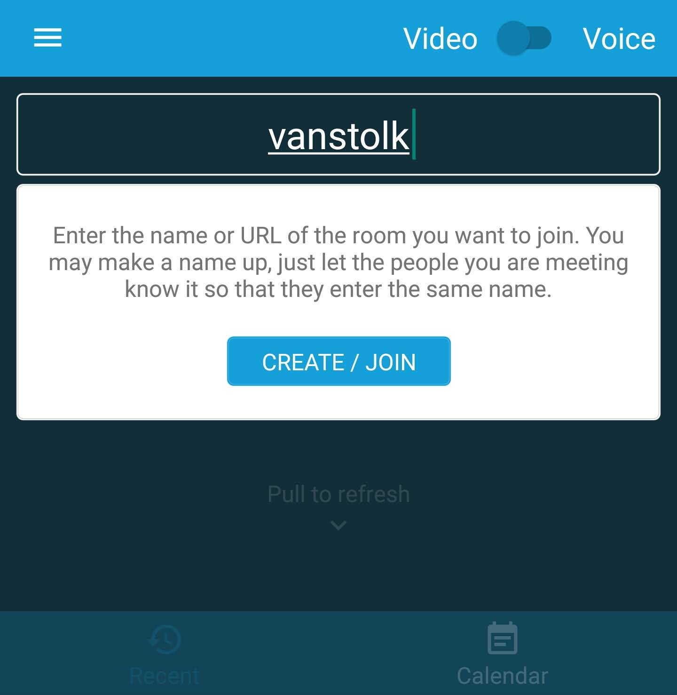

- Allow the application access to audio/video:

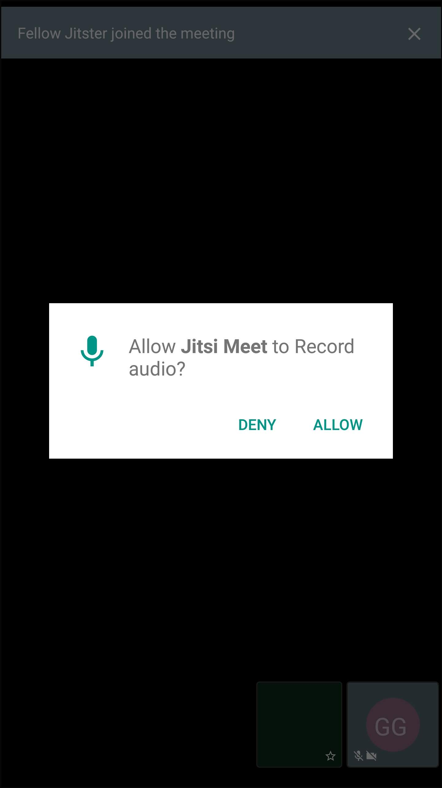

- After you leave the meeting, you don't need to go through your settings again. You will see the meeting room show up in your list and you can click on the `vanstolk` icon to re-enter the room.

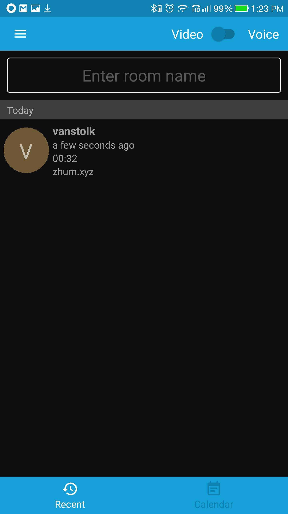

# iOS

- Download [jitsi meet](https://apps.apple.com/us/app/jitsi-meet/id1165103905) from the app store.

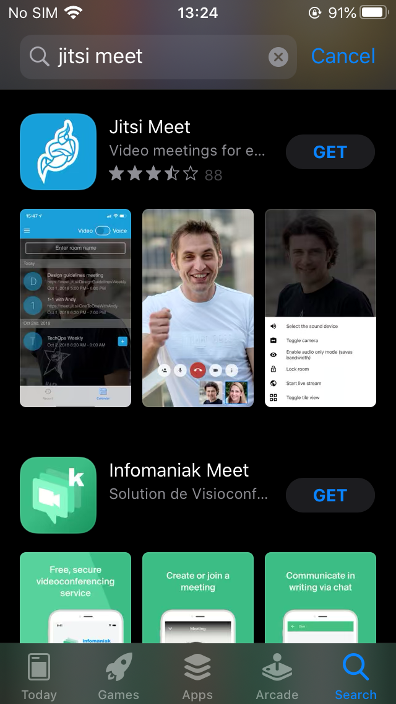

- Open the app and click on the menu icon (three horizontal bars) in the upper left. Click 'settings'.

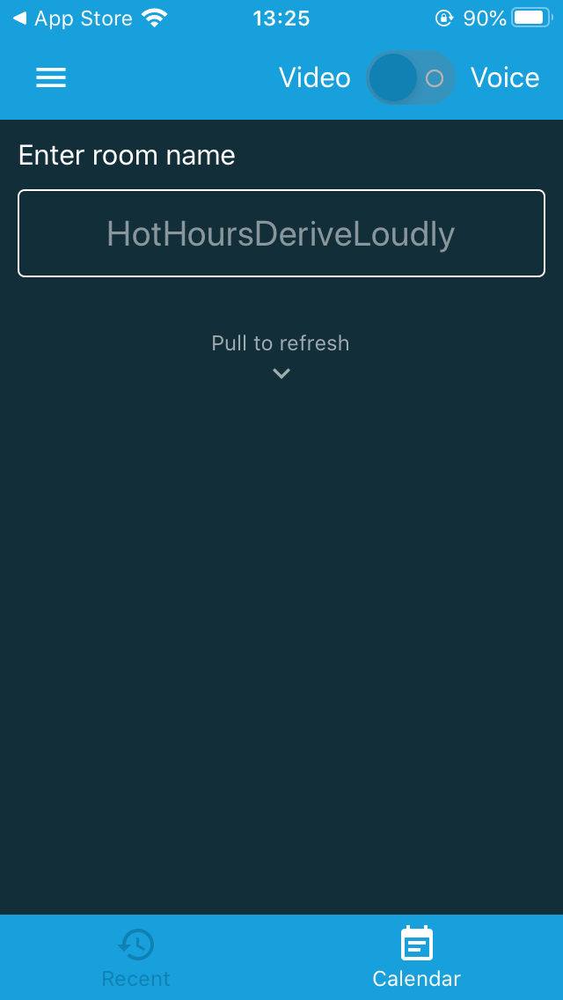

- Change the server URL to `https://zhum.xyz`. You can fill in your name if you'd like. You don't need to fill in your email.

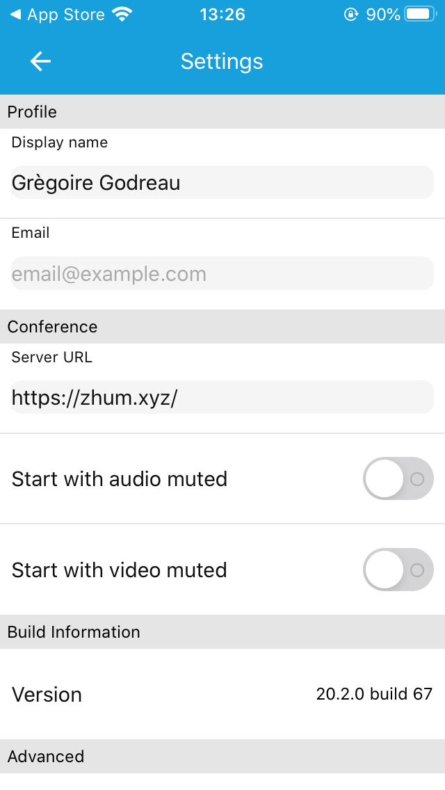

- Go back to the main jitsi app screen. Click on the `Enter room name` box. Type `vanstolk`. Hit `Create/Join`.

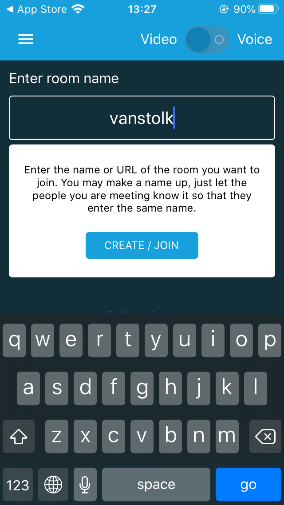

- Allow the application access to microphone/camera:

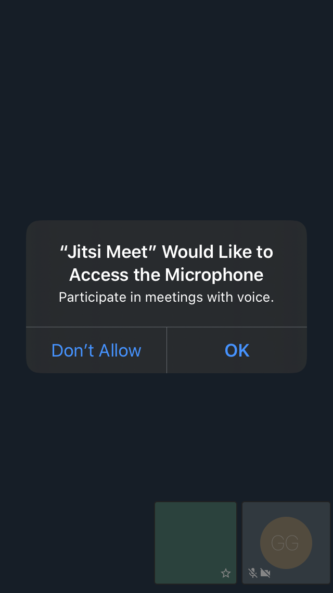

- After you leave the meeting, you don't need to go through your settings again. You will see the meeting room show up in your list and you can click on the `vanstolk` icon to re-enter the room.

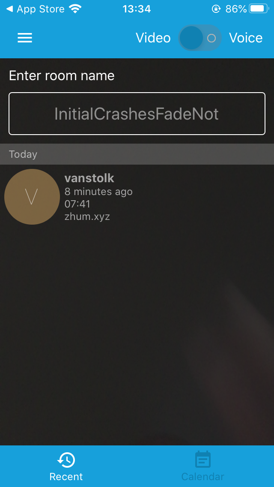

